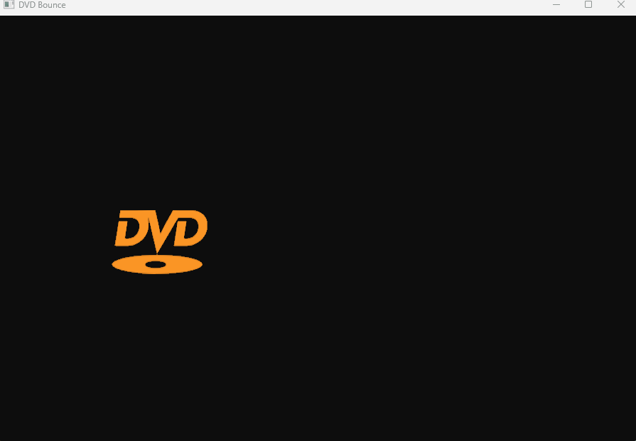

# DVD Bounce

Classic DVD logo bouncing screensaver built with OpenGL 3.3.



## Features
- Logo bounces off all 4 walls
- Random color change on each bounce
- Alpha transparency support (PNG)
- Frame-rate independent physics (delta time)
- Shader and Texture abstraction classes

## Build & Run

Requirements:
- CMake 3.10+
- Git
- C++20 compiler (MSVC, GCC or Clang)

```bash
git clone https://github.com/xrroman/DVDBounce.git
cd DVDBounce
cmake -B build
cmake --build build
cd build
chmod +x DVDBounce
./DVDBounce 
```

> GLFW is automatically downloaded by CMake via FetchContent. No manual setup needed.

## Dependencies
- [GLFW](https://github.com/glfw/glfw) — Window and input (auto-downloaded)
- [GLAD](https://glad.dav1d.de/) — OpenGL loader (included)
- [stb_image](https://github.com/nothings/stb) — Image loading (included)
